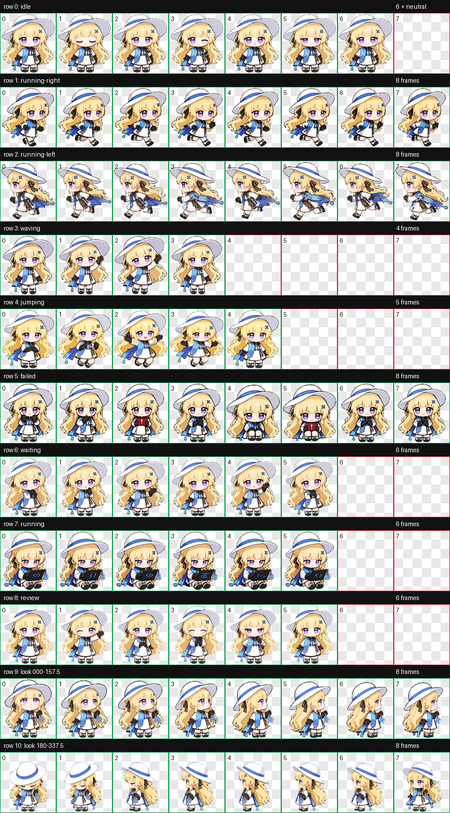

# Phoebe Codex Pet · 菲比啾比编码桌宠

<p align="center">
  
</p>

<p align="center">
  <strong>一只住在代码编辑器里的小菲比。</strong><br>
  温柔、聪明、安静待命；写代码时专注，跑通之后会开心举起小小的绿色对勾。
</p>

<p align="center">
  <a href="#安装">安装</a> ·
  <a href="#动画状态">动画状态</a> ·
  <a href="#自定义与开发">自定义与开发</a> ·
  <a href="NOTICE.md">版权说明</a>
</p>


> [!IMPORTANT]
> 这是基于《鸣潮》菲比形象的非官方同人桌宠项目，未获游戏版权方背书或授权。仓库里的 MIT 许可只覆盖本项目原创的脚本、文档和打包整理工作，不授予第三方角色、名称或相关视觉资产的权利。公开发布、二次创作或商业使用前，请自行确认权利边界。详见 [`NOTICE.md`](NOTICE.md)。

## 这是什么？

Phoebe Codex Pet 是一个适配 Codex v2 宠物格式的透明背景动画包。它把菲比最容易识别的元素——浅金长发、白色宽檐帽、紫色眼睛、右侧蓝色十字发夹、蓝白黑配色和蓝色披肩——压缩成适合桌面尺寸的 chibi 轮廓，并加入了轻量的终端、代码块和光标氛围。

它适合：

- 作为 Codex / AI coding assistant 的桌面陪伴角色；
- 做贴纸、表情包、动画状态展示或 UI 原型；
- 作为一个透明、可检查、可替换的 Codex v2 宠物素材包。

核心运行文件只有两个：`assets/pet.json` 和 `assets/spritesheet.webp`。不需要编译，也不需要额外运行服务。

## 安装

### 方式 A：一键安装（推荐）

先把仓库地址替换成你自己的 GitHub 地址：

```bash
git clone https://github.com/<YOUR_GITHUB_USERNAME>/phoebe.git
cd phoebe
./scripts/install.sh
```

安装脚本默认写入：

```text
${CODEX_HOME:-$HOME/.codex}/pets/phoebe-codex/
```

如果检测到同名旧宠物，脚本会先创建带时间戳的旁路备份，再更新 `pet.json` 和 `spritesheet.webp`。安装完成后重启或重新加载 Codex，让宠物列表重新扫描。

常用选项：

```bash
./scripts/install.sh --dry-run             # 只查看目标路径，不写文件
./scripts/install.sh --no-backup           # 明确跳过旧版本备份
./scripts/install.sh --pet-dir /path/to/pet # 指定自定义宠物目录
```

### 方式 B：手动复制

如果你不想运行脚本，也可以手动安装。下面的命令只复制运行所需的两个文件：

```bash
PET_DIR="${CODEX_HOME:-$HOME/.codex}/pets/phoebe-codex"
mkdir -p "$PET_DIR"
cp assets/pet.json "$PET_DIR/pet.json"
cp assets/spritesheet.webp "$PET_DIR/spritesheet.webp"
```

确认这两个文件位于同一个目录，然后重启 Codex：

```text
~/.codex/pets/phoebe-codex/pet.json
~/.codex/pets/phoebe-codex/spritesheet.webp
```

若你使用了自定义的 `CODEX_HOME`，请将上面的 `~/.codex` 替换为对应目录。

## 动画状态

运行时图集是 **8 列 × 11 行**，单帧 **192 × 208 px**，总尺寸 **1536 × 2288 px**，透明 RGBA WEBP，`spriteVersionNumber` 为 `2`。

Codex v2 的标准状态行如下：

| 行 | 状态 | 画面感觉 |
| ---: | --- | --- |
| 0 | `idle` | 安静待机，轻微呼吸/摇晃 |
| 1 | `running-right` | 向右移动 |
| 2 | `running-left` | 向左移动 |
| 3 | `waving` | 挥手 |
| 4 | `jumping` | 跳跃 |
| 5 | `failed` | 失败/报错后的委屈表情 |
| 6 | `waiting` | 等待确认或等待输入 |
| 7 | `running` | coding / 正在敲代码 |
| 8 | `review` | review / 思考与理解需求 |
| 9–10 | look directions | 16 个视线方向，用于视线跟随 |

各状态的 GIF 预览在 [`assets/previews/`](assets/previews/)；完整行列图在 [`assets/preview-sheet.png`](assets/preview-sheet.png)。

### 额外状态原型

用户最初设想的 `Success`、`Sleeping`、`Loading` 三种状态也保留在 [`assets/extra-state-prototypes/`](assets/extra-state-prototypes/) 中。它们是透明 PNG 分镜条，每条包含 6 个姿势，方便后续接入自定义动画层；由于 Codex v2 有固定的标准行契约，它们不会被直接塞进运行时图集。

## 预览

| Idle | Coding / Running | Review / Thinking |
| --- | --- | --- |
|  |  |  |

更多状态：[`running-right`](assets/previews/running-right.gif)、[`running-left`](assets/previews/running-left.gif)、[`waving`](assets/previews/waving.gif)、[`jumping`](assets/previews/jumping.gif)、[`failed`](assets/previews/failed.gif)、[`waiting`](assets/previews/waiting.gif)。

## 自定义与开发

### 替换成自己的版本

只要保持以下运行契约，就可以把它当作模板制作自己的宠物：

1. `pet.json` 与图集放在同一目录；
2. `spriteVersionNumber` 保持为 `2`；
3. 图集保持 8 × 11 网格，每格 192 × 208 px；
4. 每格边界留出透明安全区，避免帽檐、头发或披肩泄漏到邻帧；
5. 不要把预览图或额外状态原型误放成运行时图集。

可以先运行：

```bash
python3 scripts/validate_atlas.py
```

该检查会验证 JSON、WEBP 尺寸/格式、透明通道和每个已用帧的边缘隔离。若本地没有 Pillow：

```bash
python3 -m pip install Pillow
```

### 仓库结构

```text
phoebe/
├── assets/
│   ├── pet.json                  # Codex v2 元数据
│   ├── spritesheet.webp          # 运行时主图集
│   ├── spritesheet.png           # 便于编辑/检查的 PNG 版本
│   ├── preview-sheet.png         # 公开预览图
│   ├── look-directions.png       # 视线方向预览
│   ├── previews/*.gif            # 各标准状态动图
│   └── extra-state-prototypes/   # Success/Sleeping/Loading 原型
├── docs/
│   ├── animation-rows.md         # 图集行契约
│   └── qa/                       # 可公开的 QA 摘要
└── scripts/
    ├── install.sh                # 安装到本地 Codex 宠物目录
    └── validate_atlas.py         # 本地资产检查
```

原始参考图、生成过程和机器本地临时文件没有放进公开仓库，以免把带水印素材或本机路径一并传播。

## 故障排查

### 安装后看不到宠物

检查目录层级和文件名是否完全一致：

```bash
ls -l "${CODEX_HOME:-$HOME/.codex}/pets/phoebe-codex/pet.json" \
      "${CODEX_HOME:-$HOME/.codex}/pets/phoebe-codex/spritesheet.webp"
```

然后完全退出并重新打开 Codex。如果你设置了 `CODEX_HOME`，请确认它指向的是实际使用的 Codex 数据目录。

### 动画出现黑底、白底或锯齿

请使用仓库里的 `spritesheet.webp`，不要把 `spritesheet.png`、预览 GIF 或额外状态 PNG 当作运行时图集。WEBP 是带透明通道的正式运行资产。

### 帧之间出现帽檐/头发残片

请重新运行 `python3 scripts/validate_atlas.py`，并确认安装的是当前仓库的 `spritesheet.webp`。本版本已针对帽檐跨格和邻帧泄漏问题重做 `idle`、`running-left`、`review` 三行，并通过边缘隔离检查；QA 摘要见 [`docs/qa/`](docs/qa/)。

## 贡献

欢迎提交新的动画建议、安装兼容性反馈和素材改进。提交 PR 前请先阅读 [`CONTRIBUTING.md`](CONTRIBUTING.md)，尤其是帧尺寸、透明安全区和第三方版权要求。

## English quick start

Phoebe Codex Pet is an unofficial, fan-made Codex v2 desktop pet inspired by Phoebe from *Wuthering Waves*. Clone the repository and run:

```bash
git clone https://github.com/<YOUR_GITHUB_USERNAME>/phoebe.git
cd phoebe
./scripts/install.sh
```

The installer places the runtime pair (`pet.json` + `spritesheet.webp`) under `${CODEX_HOME:-$HOME/.codex}/pets/phoebe-codex/`. Restart Codex after installation. The atlas is 8 × 11, 192 × 208 px per cell, with transparent RGBA WEBP output. This is not an official Kuro Games product; see [`NOTICE.md`](NOTICE.md) before redistributing.

## License

Original scripts, documentation, and packaging glue are available under the [MIT License](LICENSE). Character/IP rights and any third-party source material are excluded; see [`NOTICE.md`](NOTICE.md).
